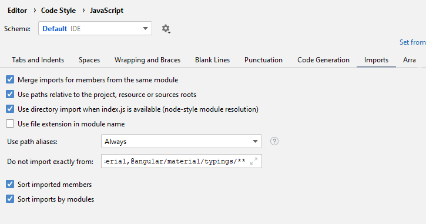

# Webstorm Import (Broken) Demo

## Note

**This project does not work as is**. It's to showcase that the auto import
feature doesn't work properly in some cases (which breaks React projects). 
Simply turning the `MyComponent` import into `{MyComponent}` fixes it. But 
Webstorm's auto import doesn't seem to do it automatically.

## Explanation

When working on this project in Webstorm, it won't properly import things that
are exported as default, and then exported as named exports by an `index.js` 
file when using absolute imports.

Example:

When given the following files:
```jsx
// src/components/MyComponent.js
const MyComponent = () => (<span>My Component</span>);

export default MyComponent;
```

```javascript
// src/components/index.js

export {default as MyComponent} from './MyComponent';
```

Webstorm's auto import feature does the following:

```jsx
import MyComponent from 'components'; // <--- Not imported manually (see below)

// Started typing "<MyComponent />", and let Webstorm import it for me.
const ParentComponent = () => (
    <MyComponent />
);
```

This fails, because the `index.js` exports `MyComponent` as a **named export**,
not as a **default export**, yet Webstorm imports them as default imports 
regardless.

## Editor settings

Here's a screenshot of my Webstorm's `Editor/Code Style/JavaScript/imports` settings:

